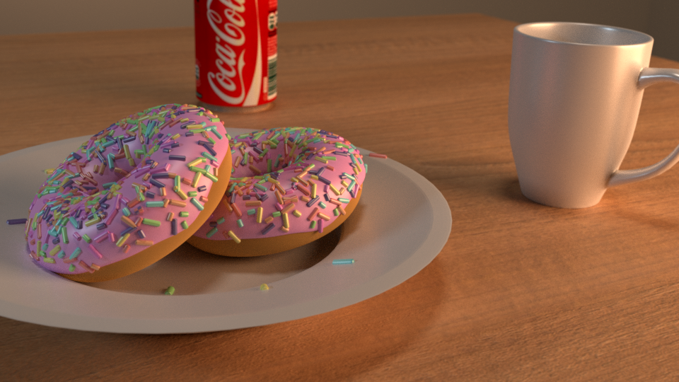
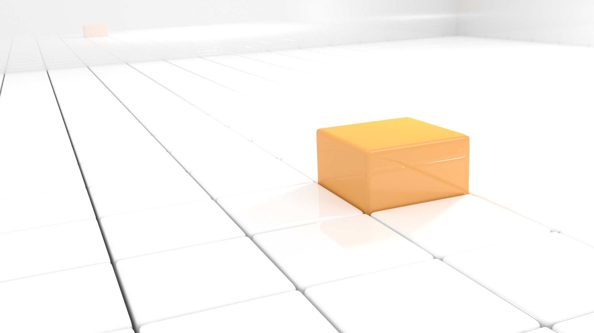
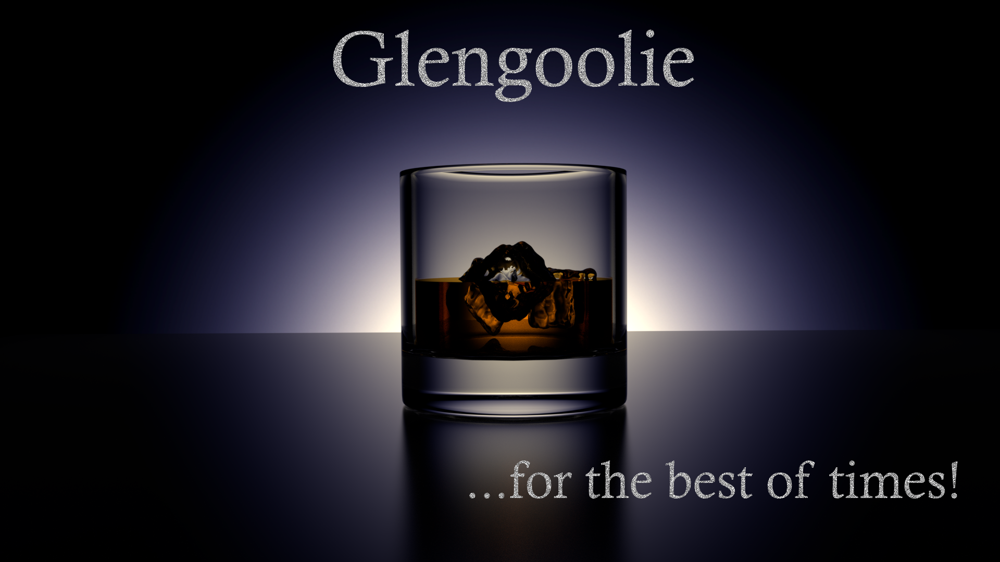

I decided I wanted to play around with 3D modelling since Blender was free and I had access to Maya as a student. Let many of my side projects, I was just curious to the processes involved. I started off with [Blender Guru's Donut Tutorial](https://www.youtube.com/watch?v=TPrnSACiTJ4), which was extremely useful. I then put the skills I had learned into practice and had a play around with the tools further to develop some other 3D renders. My favourite render was the light strip balls _(Featured)_ as I think the reflections and diffusions really make for a great composition.

