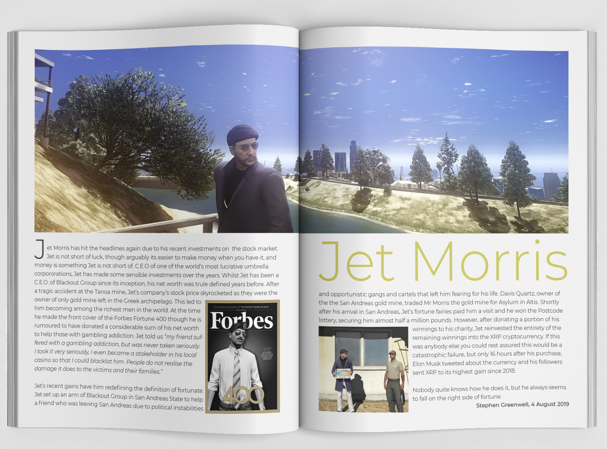
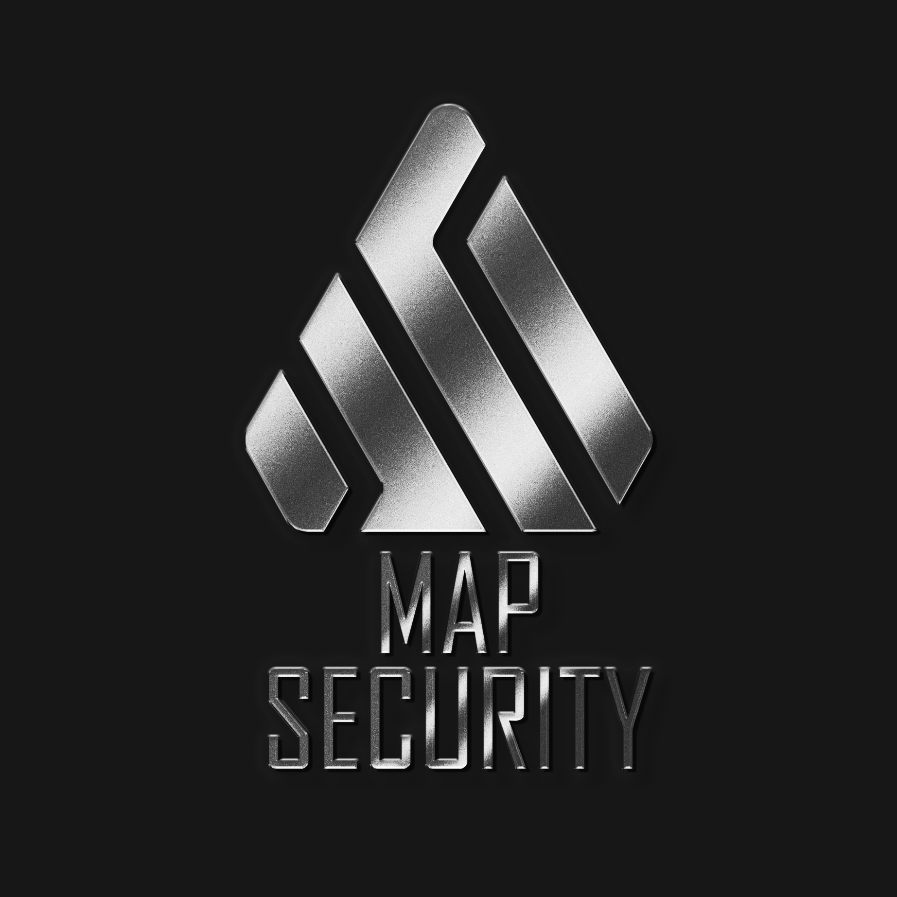
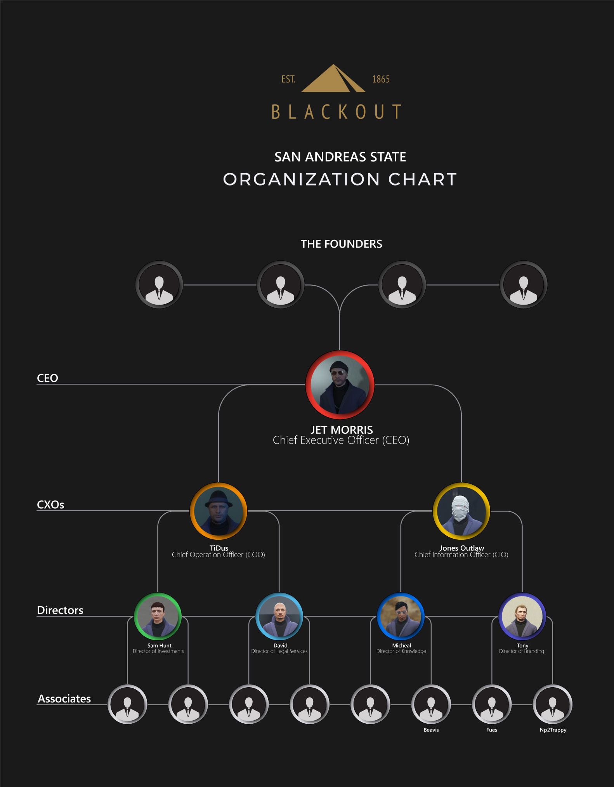

I am a big fan of roleplaying games _(e.g., Dungeons & Dragons)_, and tabletop games in general. I know they are often tabooed, but I've past the point of caring. However, there are also various video games that have a large community of modified servers that add roleplaying features. For these I created a character that spanned across three servers on two different games _(ARMA 3 & Grand Theft Auto Five)_. The longer this went on the more elaborate his story became and eventually he became the CEO of a fictional front organisation called Blackout. I seized an opportunity to mix multiple passions _(roleplaying, gaming and design)_ and created websites, logos, back story documents, news reels and even got into texture editing for Grand Theft Auto for games... and I loved every second of it. It allowed me to keep my design skills fresh and also expanded the roleplay in the game. Most of the time the roleplay documents allowed us to leverage a situation.

