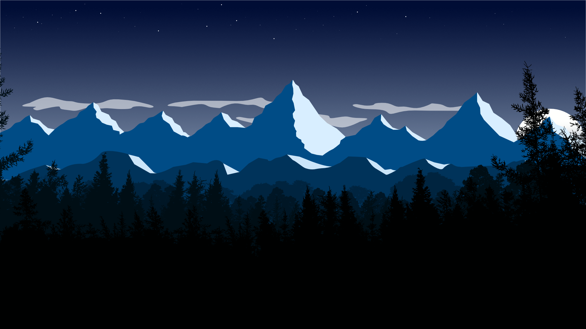

I have used Adobe Illustrator for many years. I was able to pick up copies on eBay and the likes, but then they switched to subscription. I then relied on copies I had access to through university and also through work. During lockdown, both of those options became tiresome and I became frustrated with the whole process. I tried Inkscape, but that was not for me. I then managed to pick up the entire Affinity suite on special for just over 1 month's subscription to Adobe! This was the first thing I made on Designer. I made both a Day _(Featured)_ scene and a night scene. The built in asset library and stock library made this project a breeze.    

