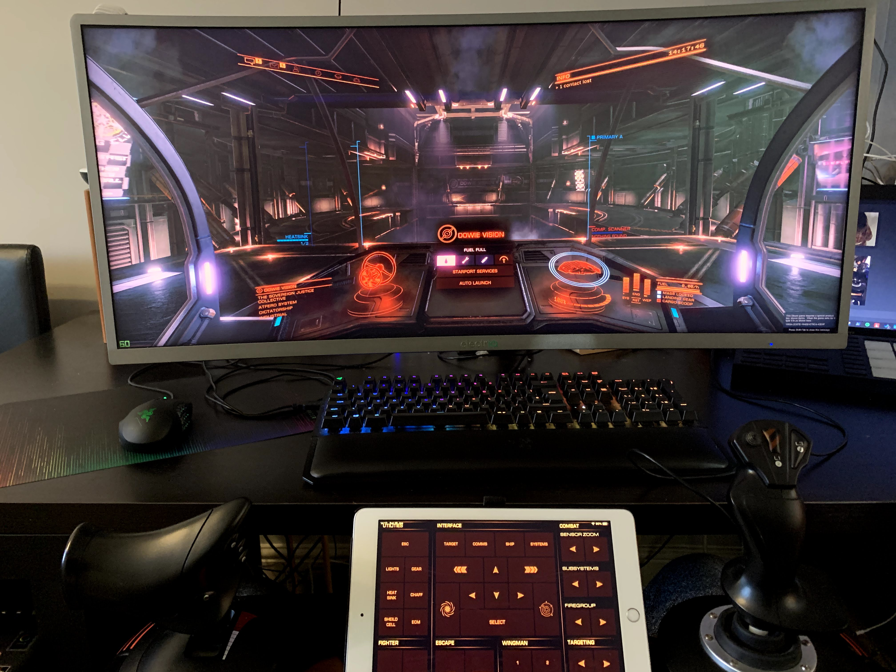

This project was a simple design of a custom Elite Dangerous keypad for **CustomKeypad** iOS app. While the project is specifically designed for **CustomKeypad**, I published the project with all the instructions and vectors that were used to make the layout, so users of other apps or Android users could use the resources to make similar solutions.

Once configured the app provided me with a panel of buttons that sits between my Joystick and Throttle stick, which are specific to Elite Dangerous and also styled in the same theme. 

---

The project is available on GitHub

<a class="btn btn-secondary" href="https://github.com/gcoulby/ed_keypad"  target="_blank" rel="noopener noreferrer"><i class="fab fa-github"></i> View on GitHub</a>