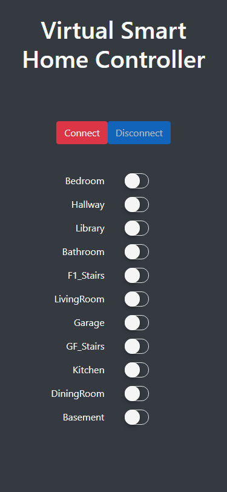

This project was created for my students on the IoT module. When face-to-face teaching ended the lecturing team strategised on how we could adapt learning resources to suit the new normal. The original plan for this exercise was to get students to control LEDs attached to an ESP32 at the front of the classroom. Students would use public MQTT brokers to send messages via Python to my device and turn the lights on and off. Once we began online learning, I abstracted this process and created the **"Virtual Smart Home"**, which is essentially an SVG file that has dark transparent layers over each room. When students _"turned the lights on"_ the dark layer was set to `display: none`, which displayed the lit up room below. The original implementation required students to publish binary messages (0 or 1) to MQTT topics associated to each room. This was done using Python, via Google Colab. 

I later moved this project over to GitHub and created a toggle switch controller to make it easier to test the functionality without code. This was just made as a simple, mobile-friendly interface:

---
#### Virtual Smart Home App

Try the app:

<a class="btn btn-secondary" href="https://gcoulby.github.io/VirtualSmartHome/"  target="_blank" rel="noopener noreferrer"><i class="fa fa-globe-europe"></i> Try the App</a>

or View the Repository on GitHub:

<a class="btn btn-secondary" href="https://github.com/gcoulby/VirtualSmartHome"  target="_blank" rel="noopener noreferrer"><i class="fab fa-github"></i> View on GitHub</a>

---
#### Virtual Smart Home Controller App

Try the app:

<a class="btn btn-secondary" href="https://gcoulby.github.io/VirtualSmartHomeController/"  target="_blank" rel="noopener noreferrer"><i class="fa fa-globe-europe"></i> Try the App</a>

or View the Repository on GitHub:

<a class="btn btn-secondary" href="https://github.com/gcoulby/VirtualSmartHomeController"  target="_blank" rel="noopener noreferrer"><i class="fab fa-github"></i> View on GitHub</a>