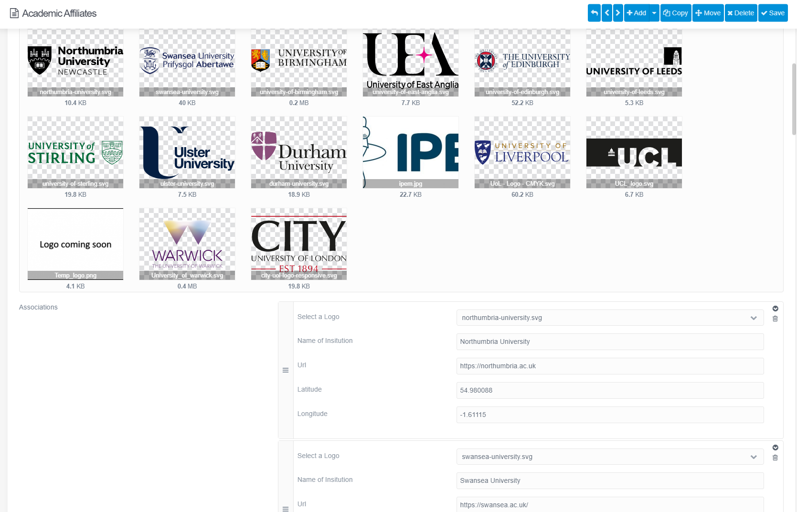

Having developed my website in Grav Content Management System, my PhD supervisor liked the aesthetics and also the platform functionality. He asked me if I could revamp the website for the Traumatic Brain Injury Research Network, to whom he is the Founder. To make the website as easy as possible for the network members to edit content, I developed custom templates and blueprints, which provided intuitive, page-specific, tailor-made forms for editing content.

