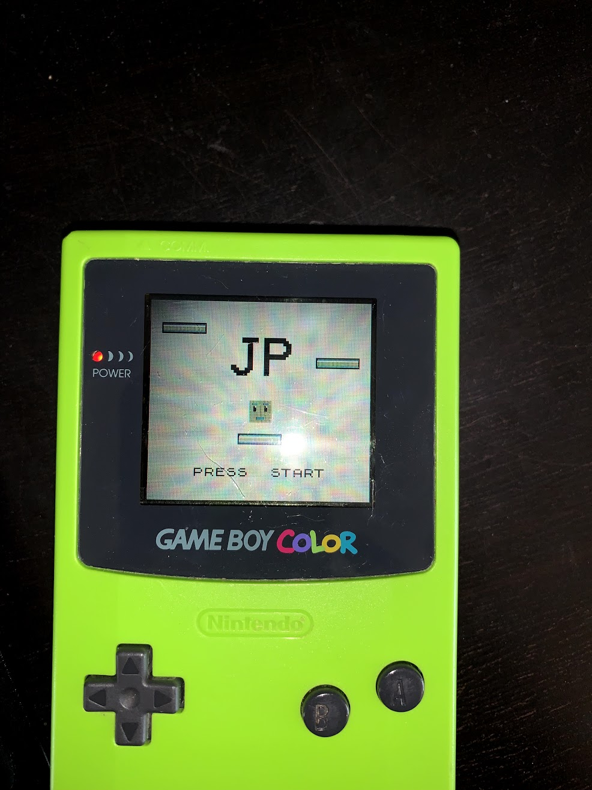
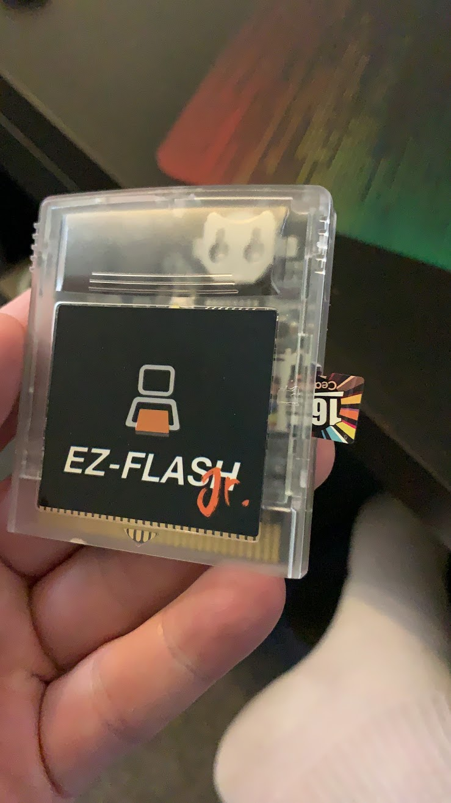
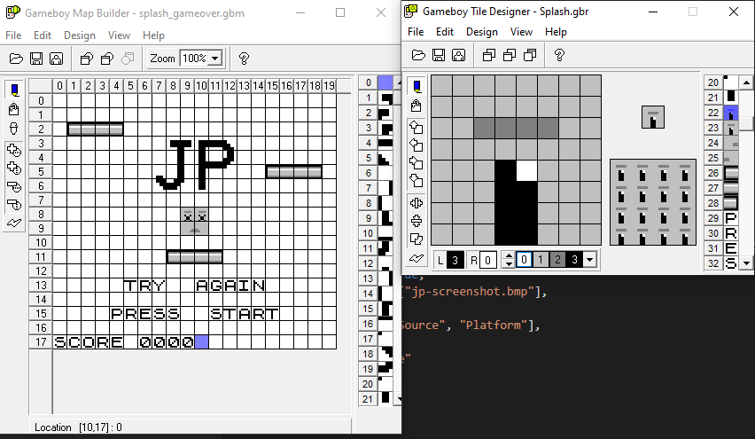
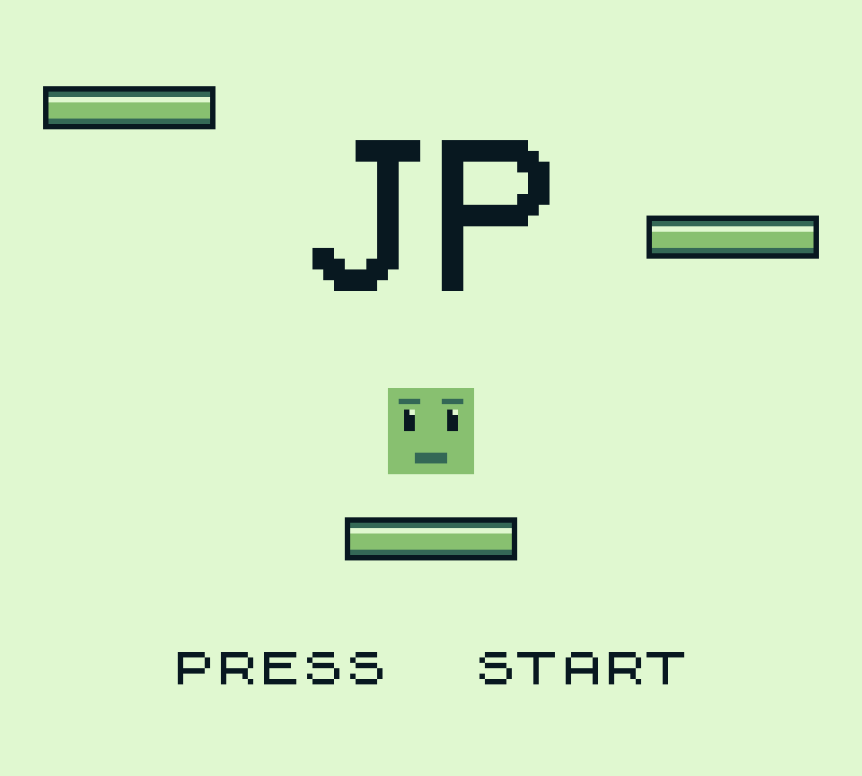
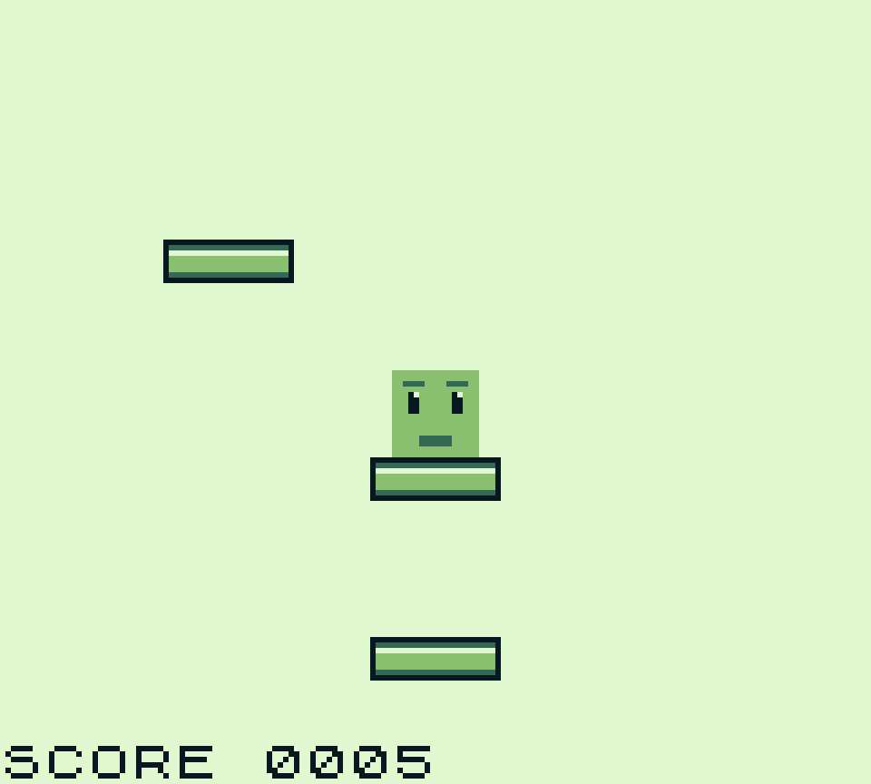
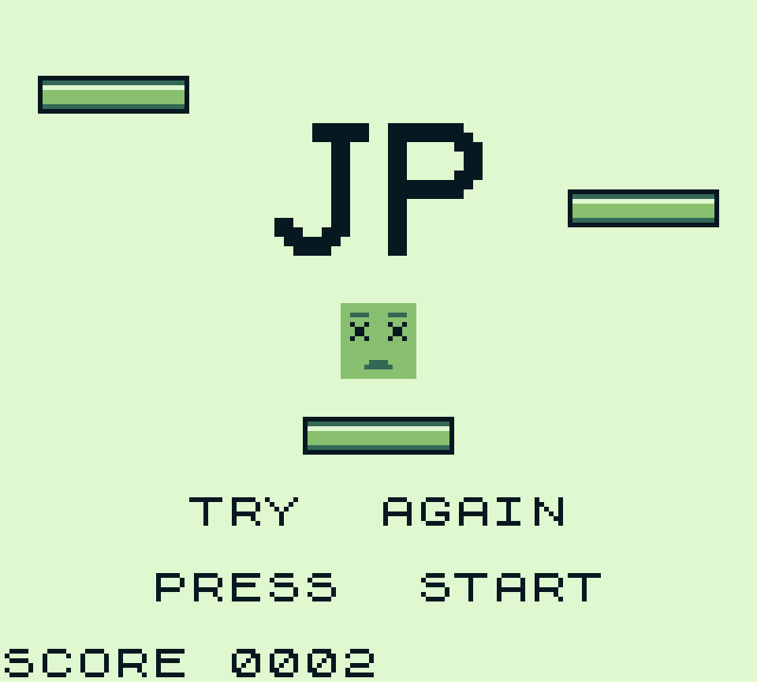

For a while I have wanted to make a game for the Nintendo Gameboy and be able to play it on the original hardware. I originally explored writing the game in GBZ80 assembly, but became unstuck quite early on. I parked the project for a while and then recently picked it back up. However, I also wanted to improve my C/C++ skills so I decided to write do this project in C using the [Gameboy Development Kit (GBDK)](https://github.com/gbdk-2020/gbdk-2020) by [Zal0](https://github.com/zal0). The reasoning behind this was that I felt the skills I would learn would be more transferable and many of the retro consoles now have C-based development kits, so it seemed like a logical choice. C is also still predominantly the language of choice for many embedded systems. 

Sprite Design was done using Affinity Designer and then the resulting pixel art was brought into the [Gameboy Tile Designer](http://www.devrs.com/gb/hmgd/gbtd.html) and the [Gameboy Map Builder](http://www.devrs.com/gb/hmgd/gbmb.html) by Harry Mulder:

JP gets its name from the GBZ80 Assembly JUMP command for jumping to different parts of the program. JP is a reaction based jump platform game, which requires the player to jump from platform to platform. However, the speed of the platforms vary slightly and the time between each platform appearance prevents the player getting into a routine of timed jumps. I was originally inspired to develop a game after reading [Doctor Ludo's Gamasutra blog entry](https://www.gamasutra.com/blogs/DoctorLudos/20171207/311143/Making_a_Game_Boy_game_in_2017_A_quotSheep_It_Upquot_PostMortem_part_12.php) and was helped greatly by [Gaming Monster's GBDK Tutorial](https://www.youtube.com/playlist?list=PLeEj4c2zF7PaFv5MPYhNAkBGrkx4iPGJo). 

To get my game on the original hardware I used the EZ Flash Cartridge with a Micro SD Card installed. 

---

View the Repository on GitHub:

<a class="btn btn-secondary" href="https://github.com/gcoulby/JP"  target="_blank" rel="noopener noreferrer"><i class="fab fa-github"></i> View on GitHub</a>

Play Online via The Homebrew Hub:

<a class="btn btn-secondary" href="https://hh.gbdev.io/game/jp"  target="_blank" rel="noopener noreferrer"><i class="fa fa-globe-europe"></i> Try the App</a>

---

###### Images and Screenshots

Game on Original Gameboy Color:

EZ Flash Jr Cartridge: 

Sprite/Map Design:

Screenshots:

